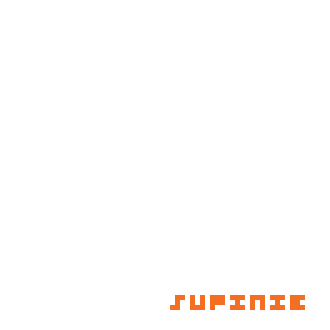

# Go md5 Hashquine Generator

This is a script to generate a gif that will display its own md5sum.

It is a Go implementation of [Rogdham's python script](https://github.com/rogdham/gif-md5-hashquine). The script works by generating a collision for all possible characters at each possible position, for both visable and hidden. Once we have finished, we can then selectively choose to display characters based on the md5sum of the file, without changing it.

Here is an example generation:



which can be seen to be displaying its own md5 hash:

```
$ md5sum hashquine.gif 
18f6d7bae1ca24b0ea3224560f046cd9  hashquine.gif
```
# How to use

## Prerequisites:

You must have fastcoll, this can be installed by the following:
```
$ git clone git@github.com:cr-marcstevens/hashclash.git
$ sudo apt-get install g++ autoconf automake libtool && sudo apt-get install zlib1g-dev libbz2-dev
$ cd hashclash && ./build.sh
$ cp bin/md5_fastcoll /usr/bin/fastcoll
$ cd .. && rm -rf hashclash     # optional
```

## Modifying settings

By default, it will run with no mask, this means that there will be no fixed hash characters. This can be changed by editing the mask variable in the Hasquine_params struct on line 43 of main.go.

## Build and running

The binary can be built by running `go build`, and can then be run as `./hashquine_generator`. It has the following options:

```
$ ./hashquine_generator -h
Usage of ./hashquine_generator:
  -o string
    	Specify the name of the output gif, by default this will be 'hashquine.gif'. (default "hashquine.gif")
  -t string
    	Specify the location of the directory containing the templates to be used. By default, this will be the building_blocks dir in the root of the repo. (default "./building_blocks")
```
